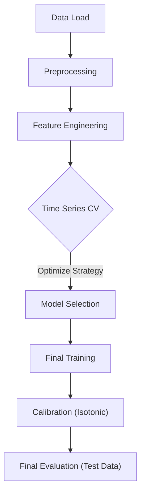
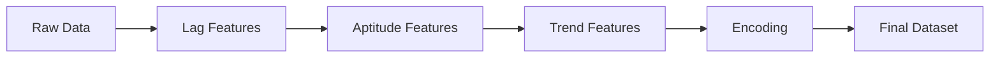
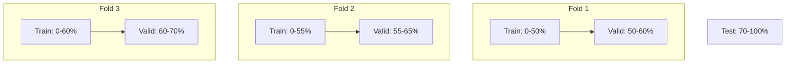

# main.py アーキテクチャ解説

このドキュメントでは、`main.py` の実装詳細と設計思想について解説します。
このスクリプトは、日本中央競馬（JRA）のレース結果を予測し、回収率100%超えを目指すための機械学習パイプラインを実装したものです。

## 1. システム概要

`main.py` は以下のフェーズで構成されるエンドツーエンドの学習・評価スクリプトです。

1.  **データ読み込み & 前処理**: CSVデータのパースと整形。
2.  **特徴量エンジニアリング**: 過去成績に基づく高度な特徴量の生成。
3.  **モデル選定 (CV)**: 時系列クロスバリデーションによるLightGBMモデルの評価と、最適な購入戦略（閾値）の探索。
4.  **最終学習 & キャリブレーション**: 全データを用いた学習と、Isotonic Regressionによる確率補正。
5.  **最終評価**: テストデータを用いた予測性能と回収率のシミュレーション。

## 2. データパイプラインとリーク防止

競馬予測において最も重要な「未来情報のリーク防止」を徹底するため、以下の設計を採用しています。

*   **時系列ソート**: 常に `(年, 月, 日, 場所, レース番号)` の順でデータを処理します。
*   **ラグ特徴量**: `shift(1)` を用いて、必ず「前走までの情報」のみを使用します。
*   **適性特徴量の累積**: 過去のレース結果を集計する際、自分自身のレース結果が含まれないように累積和 (`cumsum`) から現在値を引く処理を行っています。
*   **時系列CV**: ランダム分割ではなく、時系列に沿って Train/Valid/Test を分割し、過去のデータから未来を予測する構造を維持しています。

## 3. 主要コンポーネント詳細

### 3.1. データ処理 (`preprocess_base`, `create_features`)

生のCSVデータを読み込んだ後、以下の順序で特徴量を生成します。

1.  **基本前処理**: 日付変換、数値型変換、目的変数（`rank_class`, `is_win`）の作成。
2.  **ラグ特徴量 (`add_lag_features`)**:
    *   1走前の着順、着差、上がり3F、PCI（ペース指数）などを取得。
    *   レース間隔、斤量変化、馬体重変化、昇級/降級フラグを計算。
3.  **適性特徴量 (`add_aptitude_features`)**:
    *   馬ごとの「過去全体」「コース別」「芝・ダ別」「距離別」の成績（平均着順、勝率、複勝率）を算出。
    *   **平滑化**: 小標本のノイズを抑えるため、事前分布（全体平均）を用いたベイズ的なスムージング（`USE_SMOOTHED_APTITUDE`）を適用。
4.  **傾向特徴量 (`add_trend_features`)**:
    *   直近N走（デフォルト5走）の移動平均、加重移動平均（指数減衰など）。
    *   近走の勢い（上がりタイム、PCIの推移）を捉える。
5.  **エンコーディング (`add_encoding_features`)**:
    *   騎手、調教師、種牡馬の勝率をターゲットエンコーディング。
    *   長距離輸送フラグの作成。

### 3.2. 学習と戦略探索 (`train_and_evaluate_cv`)

LightGBM (`lgb.LGBMClassifier`) を使用して、4クラス分類（1着、2着、3着、その他）問題を解きます。

*   **時系列CV**: 3つのFoldで期間をずらしながらモデルを評価。

※ 上記は概念図です（実際は `race_id` の時系列順で分割）。

*   **戦略探索 (`select_best_strategy_on_valid`)**:
    *   Validデータ上で、予測確率とオッズを組み合わせた「期待値（EV）」を計算。
    *   様々な閾値（確率閾値、EV閾値、複勝確率閾値）の組み合わせをグリッドサーチ。
    *   **選定基準**: 「安定して回収率が高い」かつ「購入数が一定以上ある」戦略を採用。

### 3.3. キャリブレーション (`train_final_and_calibrate`)

モデルの出力する確率は必ずしも実際の勝率と一致しないため、補正を行います。

*   **Isotonic Regression**: Validデータの予測結果を使って、予測確率を実際の勝率にマッピングする補正モデルを学習します。
*   **補正後EV戦略**: 補正された確率を用いて、再度最適な購入戦略（閾値）を探索します。ここでは「実績回収率と期待回収率の乖離（信頼性誤差）」を最小化する方針も採用されます。

### 3.4. 評価 (`evaluate_model`)

最終的なテスト期間（データの最後の30%）を用いて、以下の観点で評価します。

*   **分類性能**: Accuracy, Classification Report.
*   **確率精度**: Brier Score, キャリブレーション曲線（Reliability Diagram）。
*   **収益性**:
    *   CVで選ばれた戦略に基づくシミュレーション。
    *   期待値（EV）のデサイル分析（EVが高い群が実際に回収率が高いかを確認）。
    *   補正前後のパフォーマンス比較。

## 4. 設定・パラメータ (`STRATEGY_PARAMS`, `MODEL_CANDIDATES`)

*   **MODEL_CANDIDATES**: 正則化の強さが異なる複数のモデル定義を持ち、CVで最適なものを選択します。
*   **ROLLING_WINDOW**: 近走の傾向を見る期間（デフォルト5走）。
*   **WEIGHT_PATTERNS**: 加重移動平均の重み付け（指数関数的重み付け `exp` を採用）。

## 5. 出力

スクリプト実行時、標準出力に以下のような詳細なレポートが出力されます。

*   CVごとの回収率と安定性。
*   最終採用されたモデルと戦略のパラメータ。
*   テストデータにおける回収率シミュレーション結果。
*   的中馬/非的中馬の特徴量比較。
*   キャリブレーション曲線とBrier Scoreの改善度。

## 6. 今後の拡張性

*   **特徴量**: `create_features` パイプラインに新しい関数を追加することで容易に拡張可能。
*   **モデル**: `MODEL_CANDIDATES` に新しいパラメータセットを追加するだけで自動的に評価対象になります。
*   **評価指標**: `select_best_strategy_on_valid` 内のロジックを変更することで、重視する指標（的中率重視、回収率重視など）を調整可能。
